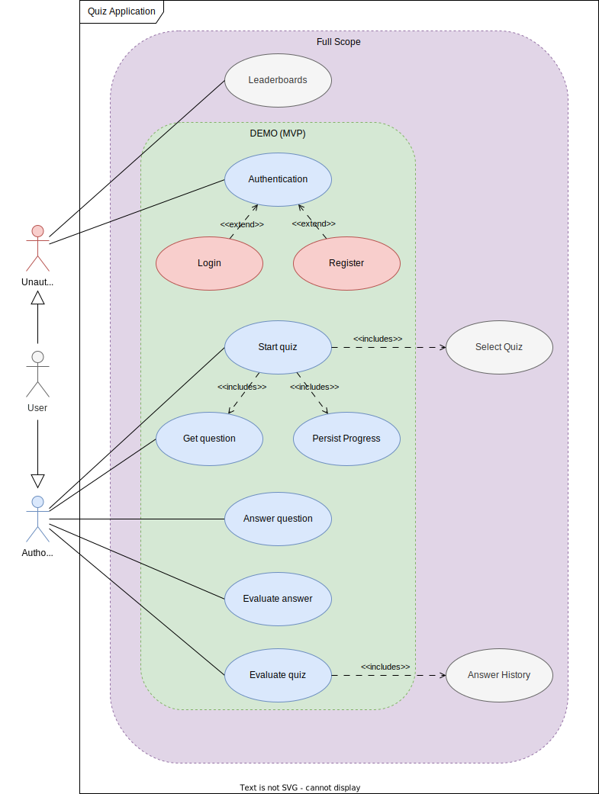
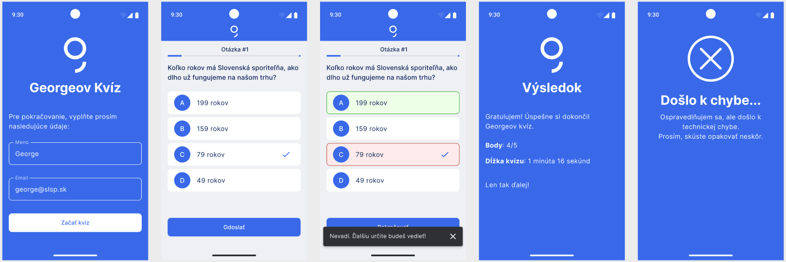

# Business Assignment - Quiz Demo

## Executive Summary

### Solution Overview
The Quiz Mobile Application is a dynamic, interactive platform designed to engage users in quizzes across various topics.

It aims to provide an educational and entertaining experience, with an optional web component for viewing leaderboards.

### Objectives
- To create an engaging and interactive quiz experience for users.
- To provide a competitive platform with a leaderboard to encourage user retention.

### Scope
- The scope includes the development of a mobile application with `signup` / `signin`, `quiz participation`, and `result-viewing` functionalities.
- Public web application displaying global leaderboards in real-time is not part of DEMO phase. `DEMO - OUT-OF-SCOPE`

### Assumptions and Constraints

#### Assumptions
- **User Base**: It is assumed that the primary users will be familiar with mobile applications and quizzes.
- **Internet Connectivity**: Users are assumed to have consistent access to the internet to use the application.
- **Device Compatibility**: The application is designed for modern iOS and Android devices, assuming users will have devices updated to at least two versions behind the current operating system.

#### Constraints
- **Development Timeframe**: The project has a fixed timeline of 3 weeks from inception to launch.
- **Budget**: The budget is limited, restricting the extent of features and third-party services that can be integrated.
- **Technical**: The application must operate efficiently across various devices, including older models with limited processing power and storage.
- **Scope Division**: The project scope is divided into two parts: a `DEMO` as an MVP (Minimum Viable Product) to be delivered first, focusing on core functionality, and a `Full Scope` part for extended features to be addressed later.

### Target Audience
The primary target audience includes students and individuals looking for educational entertainment.

## Business Requirements

### Problem Statement
Users seek engaging ways to learn and test their knowledge on various subjects.

### Business Objectives
Increase user engagement and retention.
Provide an educational tool for a wide range of topics.

### Stakeholders
Target Users - Individuals seeking to learn through interactive quizzes.

### Functional Requirements
#### `DEMO`
- **User Authentication and Registration**: Allow users to sign up and log in to the application, capturing essential information such as name and email.
- **Quiz Participation**: Users should be able to participate on **predefinied quiz**, answer its questions, receive immediate feedback, and receive quiz evaluation.
- **Imediate Feedback**: Provide users imediate feedback after every answered question.
- **Quiz Evaluation**: Display a quiz result screen at the end of the quiz, showing the user’s total score, and the elapsed time taken to complete the quiz. 

#### `Full Scope` - Extentions
- **Quiz Selection**: Users should be able to **choose** from a **variety of quizzes**, answer questions, and receive immediate feedback.
- **Quiz Evaluation - Answer History**: Include a detailed breakdown of each question, showing the user’s selected answers, correct answers, and whether the response was correct or incorrect.
- **Leaderboard Integration (Web Application)**: Display top scores and rankings on a web-based leaderboard to foster a competitive environment.

Source: [Quiz Use-Case Diagram](assets/quiz-use_cases.drawio)

### Non-Functional Requirements
- **Scalability**: The application should be scalable to accommodate a growing number of users.
- **Responsiveness**: Ensure a seamless user experience across different devices and screen sizes.
- **Security**: Implement robust security measures to protect user data and privacy.

### Designs

#### UX Design Introduction

As part of the project, the UX designer has provided a set of design assets that will serve as the foundation for the application’s user interface and user experience. These designs aim to ensure the application is intuitive, visually appealing, and aligned with the project’s objectives.

#### Key Highlights of the UX Designs:

- **User-Centric Approach**: The designs prioritize ease of use and accessibility, ensuring seamless navigation across the application for all user groups.
- **Consistency**: Visual elements, including typography, color schemes, and layouts, adhere to a cohesive design language to create a professional and engaging experience.
- **Mobile-First Design**: Given the diverse range of devices users may operate, the designs emphasize responsiveness and optimal performance on mobile devices.
- **Prototyped User Flows**: The provided designs include clickable prototypes to illustrate the end-to-end user journey, covering both the DEMO/MVP scope and the extended full scope.

##### Deliverables from the UX Designer:

- Wireframes for key application screens.
- High-fidelity mockups for the DEMO/MVP phase.
- Design assets (e.g., icons, images, and style guide) packaged for easy integration by the development team.

These designs will guide development efforts, ensuring alignment with user expectations and the overall project vision. The team will collaborate closely with the UX designer to address any iterative changes needed during the development process.

#### High-fidelity mockups - Preview
