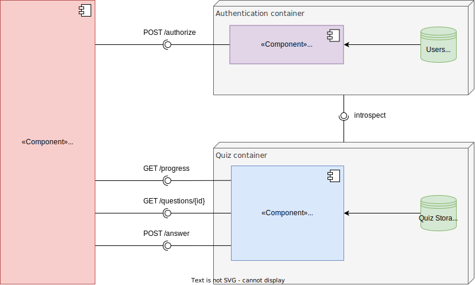

# Solution Architecture

## Overview
The solution architecture follows a client-server model, with the mobile app (`Quiz_App`) as the client and a backend server (`Quiz_Microservice`) handling business logic and data operations.

Identity provider (`Authentication_Server`) serves to provide measuers both to Secure API access and User Authentication.

## High-Level Architecture Diagram

Source: [Solution Architecture - Component Diagram](assets/quiz_backend-component_diagram-simplified.drawio)