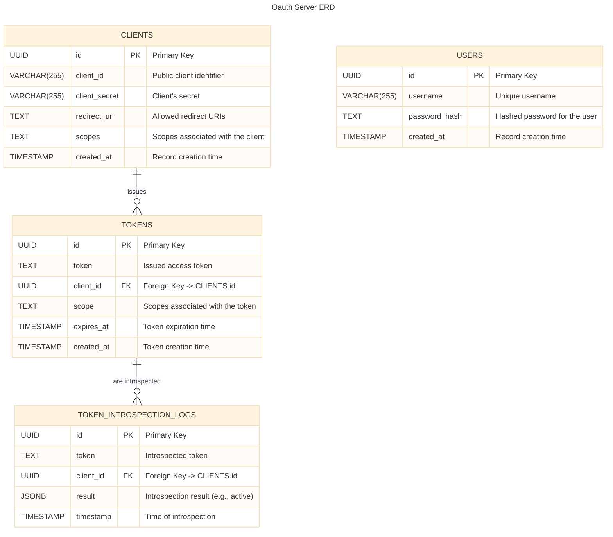
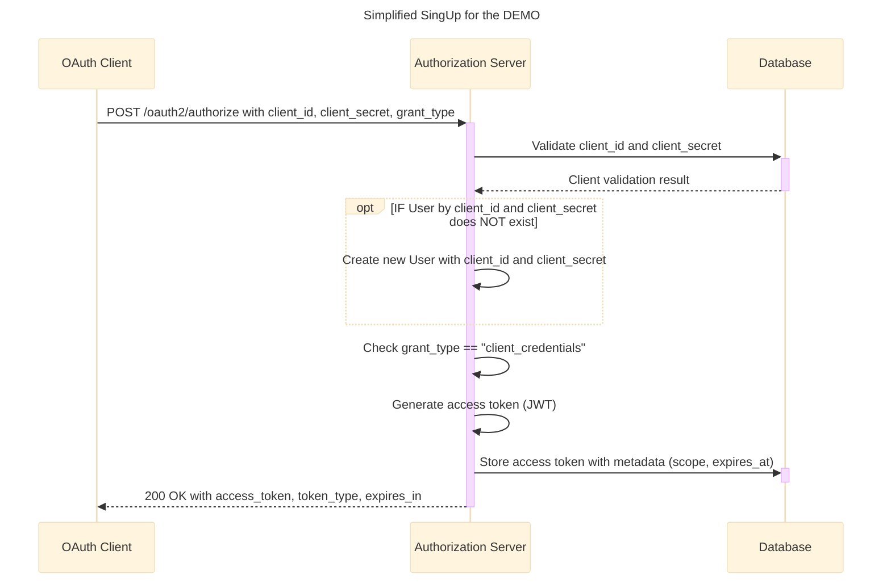
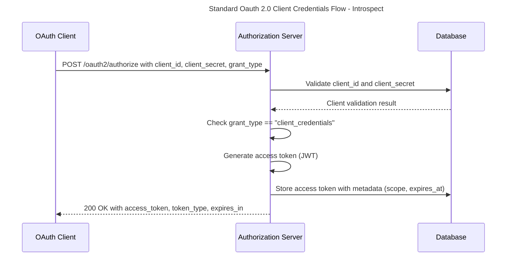
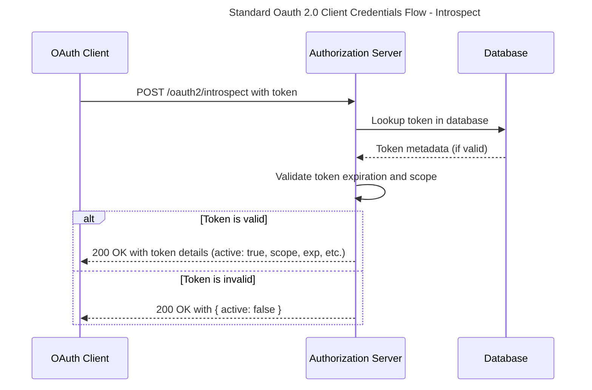

# 🔒 Authentication_Server Specification

## Overview
Standard Oauth 2.0 server according to [RFC 6749](https://datatracker.ietf.org/doc/html/rfc6749).
- Client Credentials Flow

## 💾 Auth Storage model

## 🔒 Auth API
**Standard Oauth 2.0 Client Credentials Flow.**

#### 🎯 Purpose
The `Authorization Server` is designed to facilitate secure authorization and authentication in applications using the OAuth 2.0 protocol. It serves as the central authority for issuing, validating, and managing access tokens, which allow clients to securely access protected resources.

##### Key Objectives

1. **Secure Authorization**:
   - Allows clients (e.g., applications, services) to authenticate themselves and obtain access tokens using the OAuth 2.0 **Client Credentials Flow**.
   - Ensures secure exchange of sensitive credentials like `client_id` and `client_secret`.

2. **Token Introspection**:
   - Provides a mechanism to validate and retrieve metadata for tokens through the `/oauth2/introspect` endpoint.
   - Helps resource servers verify the validity and scope of tokens before granting access to protected resources.

3. **Centralized Token Management**:
   - Enables the issuance, storage, and management of tokens, ensuring they are securely generated, tied to specific clients, and have appropriate lifetimes and permissions.

4. **Scalability and Interoperability**:
   - Designed to work across multiple clients and resource servers in a distributed architecture.
   - Supports standards-based communication to ensure compatibility with various OAuth 2.0-compliant systems.

For more details see: [RFC 6749](https://datatracker.ietf.org/doc/html/rfc6749)

### 🧠 Business Logic

### 📐 API Structure
- [**Authentication Server OpenAPI**](authentication_server-openapi.yaml)

#### ⚙️ POST /oatuh2/authorize

#### ⚙️ POST /oatuh2/introspect

## 📑 Related Documentation
- [🏗️ Solution Architecture - Component Diagram](../../solution_design/solution_architecture/assets/quiz_backend-component_diagram-simplified.svg)